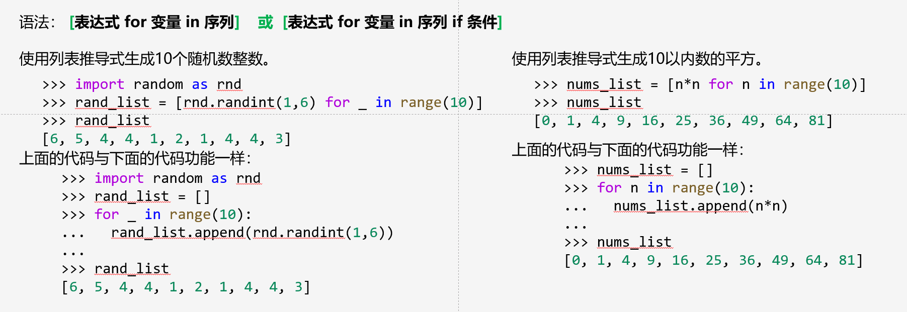

# 第一章

## 对象（Object）

不可变对象：创建后其值不可变，比如数字、字符串、元组
可变：对象的值可以改变，比如列表、集合、字典
a is b:判断是否是同一个对象
a == b:判断是否具有相同值

## 变量名（name）

**以字母或下划线开头**，之后字符可以是字母、下划线或数字，不能有空格与标点符号
大小写敏感

## 整数（int）

整数运算：

```
a/b     精确除法
a//b    整除，结果符号与b相同
a%b     求余，**精确除法向下取整**
a**b    乘方 a^b
```

## 浮点数（float）

比较两个浮点数大小，使用差的绝对值小于很小值

## 复数（complex）

形式：a+bj，j为虚数

应该不是重点。。。

## 布尔（bool）

取值只有**True**与**False**

运算：

```
not（非）
and（与） a取值False，b不计算直接返回
or（或）  a取值True，b不计算直接返回
```

## 混合运算

```
混合运算规则:
1.  当表达式中仅包含一种数字类型(bool, int, float, complex)时，最终的结果取决于该类型的操作符所规定的结果。例如整数的除法，其结果是浮点；而整数的整除，其结果是整数。
2.  当表达式中包含多种数字类型(bool, int, float, complex)时，最终的结果取决于最高级别的数字类型；且在计算前，先转换成相应的数据类型，然后再计算。数字类型的级别如下:
由低到高：bool、int、float、complex
```

## 内置函数

```
abs(x):  返回x的绝对值
round(num[,digits]):  返回num的四舍五入取整，有digits则保留digits位小数
max():  返回参数中最大值
min():  返回参数中最小值
sum():  返回参数的和
```

## random模块

使用时，开头加：import random


## math模块：常数与函数

感觉不怎么用，知道pi与e、ceil和floor的用法应该就行


# 第二章

## 序列：以非负整数作为索引的有限有序集

1. 包含：list、tuple、str、bytearray、bytes
2. 可变：list、bytearray
3. 不可变：bytes、tuple、str
4. 使用len(a)返回序列a的长度

## 集合：由不重复且不可变对象组成的无序且有限的集合

1. 不能通过下标索引。
2. 使用len(a)返回集合a的长度

## 映射：由任意索引集合所索引的对象的集合

1. 只有字典一种类型，键集合中的对象必须是可hash的对象

## 列表(list)：

### 常用方法：


### 创建：

1. 使用[]创建：empty_list=[]
2. 使用list()函数：empty_list = list(x)  x为可迭代对象

### range对象

语法：

```
range([start,]stop[,step])  返回range对象，使用list()将range对象转化为列表
```

使用方法可以看这篇文章：[python中[-1] [:-1] [::-1] [n::-1] 切片的用法\_python中切片[1:-1]-CSDN博客](https://blog.csdn.net/Vince_ZHU/article/details/107602135)

### 删除/增加元素

删除: del var_list

增加：


当使用“\*”运算符将包含列表的列表重复并创建新列表时，并不创建元素的复制，而是创建已有对象的引用：每个重复元素所指向对象（地址）是相同的。

### 成员资格判定

1. 使用关键字'in'，返回值为bool
2. list的count(value)方法

### 切片

语法：nums\_list[[start]:[stop]:[step]]

返回值：列表元素的浅拷贝，这里要与别名、深拷贝进行对比

```
别名：
  b=a
浅拷贝：
  b_list=a_list.copy()
  b_list=list(a_list)
  b_list=copy.copy(a_list)
深拷贝： 引入copy模块后
   b_list=copy.deepcopy(a_list)
```

利用切片可以原地修改列表或删除列表元素


|  |
| ----------------------------------------------------- |
|  |

### 排序

1. 列表的sort方法： a.sort(key=None,reverse=False)    就地排序
2. 内置sorted:    sorted(a,key=None,reverse=False)  返回排序好的新对象

### 逆序

1. 列表的reverse()方法：    a.reverse()    就地排序
2. 内置reversed()函数：    reversed(a)    返回一个**一次性**迭代器对象，原对象不变

### 序列操作


### 列表推导式(list comprehension)



可以看这篇博客学一学：[【Python】推导式（列表推导式、元组推导式、字典推导式、集合推导式）详解-CSDN博客](https://blog.csdn.net/qq_32727095/article/details/118959610)

## 元组(tuple)
