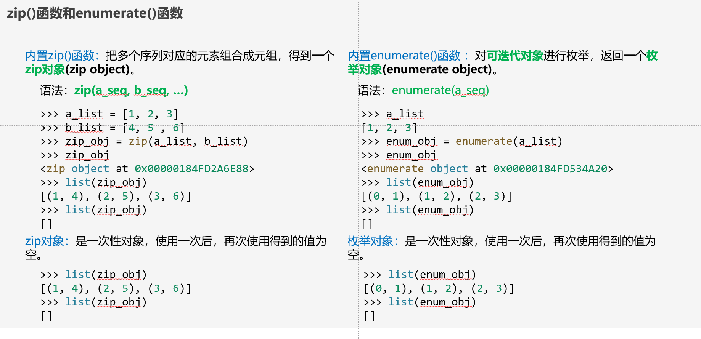
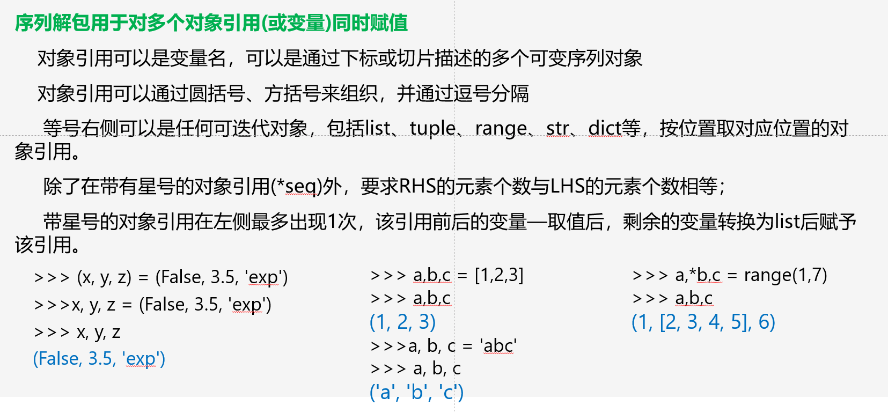

# 第一章

## 对象（Object）

不可变对象：创建后其值不可变，比如数字、字符串、元组
可变：对象的值可以改变，比如列表、集合、字典
a is b:判断是否是同一个对象
a == b:判断是否具有相同值

## 变量名（name）

**以字母或下划线开头**，之后字符可以是字母、下划线或数字，不能有空格与标点符号
大小写敏感

## 整数（int）

整数运算：

```text
a/b     精确除法
a//b    整除，a/b 的结果向下取整
a%b     求余，等于 a-(a//b)*b ，利用了公式 a=(a//b)*b + a%b
a**b    乘方 a^b
```

## 浮点数（float）

比较两个浮点数大小，使用差的绝对值小于很小值

## 复数（complex）

形式：a+bj，j为虚数

应该不是重点。。。

## 布尔（bool）

取值只有**True**与**False**

运算：

```text
not（非）
and（与） a取值False，b不计算直接返回
or（或）  a取值True，b不计算直接返回
当使用not操作符时，返回的结果总是True或False；
and or not 计算的结果不一定是True或False，请看右侧的例子
当使用and操作符时，如果第1个对象为空对象，则直接返回第1个对象；否则计算and后面的表达式，以该表达式的结果作为最后的结果；
当使用or操作符时，如果第1个对象为非空对象，则直接返回第1个对象；否则计算or后面的表达式，以该表达式的结果作为最后的结果。
```

## 混合运算

```text
混合运算规则:
1.  当表达式中仅包含一种数字类型(bool, int, float, complex)时，最终的结果取决于该类型的操作符所规定的结果。例如整数的除法，其结果是浮点；而整数的整除，其结果是整数。
2.  当表达式中包含多种数字类型(bool, int, float, complex)时，最终的结果取决于最高级别的数字类型；且在计算前，先转换成相应的数据类型，然后再计算。数字类型的级别如下:
由低到高：bool、int、float、complex
```

## 内置函数

```text
abs(x):  返回x的绝对值
round(num[,digits]):  返回num的四舍五入取整，有digits则保留digits位小数
max():  返回参数中最大值
min():  返回参数中最小值
sum():  返回参数的和
```

## random模块

使用时，开头加：**import random**

下面函数使用的方式都是random.function()的方式,比如random.random()、random.uniform()


## math模块：常数与函数

感觉不怎么用，知道pi与e、ceil和floor的用法应该就行


# 第二章

## 序列：以非负整数作为索引的有限有序集

1. 包含：list、tuple、str、bytearray、bytes
2. 可变：list、bytearray
3. 不可变：bytes、tuple、str
4. 使用len(a)返回序列a的长度

## 集合：由不重复且不可变对象组成的无序且有限的集合

1. 不能通过下标索引。
2. 使用len(a)返回集合a的长度

## 映射：由任意索引集合所索引的对象的集合

1. 只有字典一种类型，键集合中的对象必须是可hash的对象

## 列表(list)

### 常用方法


### 创建

1. 使用[]创建：empty_list=[]
2. 使用list()函数：empty_list = list(x)  x为可迭代对象

### range对象

语法：

```text
range([start,]stop[,step])  返回range对象，使用list()将range对象转化为列表
```

使用方法可以看这篇文章：[python中[-1] [:-1] [::-1] [n::-1] 切片的用法\_python中切片[1:-1]-CSDN博客](https://blog.csdn.net/Vince_ZHU/article/details/107602135)

### 删除/增加元素

删除: del var_list

增加：


当使用“\*”运算符将包含列表的列表重复并创建新列表时，并不创建元素的复制，而是创建已有对象的引用：每个重复元素所指向对象（地址）是相同的。

### 成员资格判定

1. 使用关键字'in'，返回值为bool
2. list的count(value)方法

### 切片

语法：nums\_list[[start]:[stop]:[step]]

返回值：列表元素的浅拷贝，这里要与别名、深拷贝进行对比

```text
别名：
  b=a
浅拷贝：
  b_list=a_list.copy()
  b_list=list(a_list)
  b_list=copy.copy(a_list)
深拷贝： 引入copy模块后
   b_list=copy.deepcopy(a_list)
```

利用切片可以原地修改列表或删除列表元素


|  |
| ----------------------------------------- |
|  |

### 排序

1. 列表的sort方法： a.sort(key=None,reverse=False)    就地排序
2. 内置sorted:    sorted(a,key=None,reverse=False)  返回排序好的新对象

### 逆序

1. 列表的reverse()方法：    a.reverse()    就地排序
2. 内置reversed()函数：    reversed(a)    返回一个**一次性**迭代器对象，原对象不变

### 序列操作



enumerate可以指定生成的初始下标：

可以看下面这篇文章：

[Python enumerate() 函数 | 菜鸟教程 (runoob.com)](https://www.runoob.com/python/python-func-enumerate.html)

### 列表推导式(list comprehension)


可以看这篇博客学一学：[【Python】推导式（列表推导式、元组推导式、字典推导式、集合推导式）详解-CSDN博客](https://blog.csdn.net/qq_32727095/article/details/118959610)

## 元组(tuple)

**不可变序列，元组中的每一个数据称为元素，元组的所有元素放在一对中括号“(”和“)”中，并使用逗号分隔开**

### 创建

1. 使用()创建
2. 空数组     empty_tuple = ()
3. 一个元素   empty_tuple = (3,)    注意逗号
4. tuple()函数

```text
可以把字符串、列表、元组、range对象等可迭代对象类型转换为元组对象。
empty_tuple = tuple()
empty_tuple = tuple("hello")
```

3. 使用逗号创建

```text
saying_tuple = 'One', 'Stone', 'two', 'birds'
```

4. 删除：元组是不可变对象，因此不能删除其任何元素。但是如果其元素是列表对象（可变对象），则可对该元素内进行增删改。

### 基本操作

1. 连接和重复： + *
2. 成员关系操作： in | not in | count(x) | index(value,[start,[stop]])
3. 比较运算 < | > | <= | >= | != | ==
4. 内置函数:

```text
sorted(iterable): 排序后返回新的元组
  len(iterable)、max(iterable)、min(iterable)： 长度，最大值，最小值 
  sum(iterable): 数值元素的和
  enumerate(iterable): 返回枚举对象，每次返回包含下标和值得元组
  zip(iter1,iter2…):  返回zip对象，每次返回各个可迭代对象中对应的相同位置的各个元素组成的元组
```

### 序列解包



1. 用于字典，返回字典的key
2. 变量可以是元素或者切片
3. 可以嵌套
4. 用在zip()和enumerrate()、遍历中

### 生成器推导式

生成器推导式与列表推导式非常接近，只是生成器推导式使用圆括号而不是列表推导式所使用的方括号。

返回结果是一个生成器对象


## 集合

集合中的元素不重复，且无序；集合中的元素必须是可hash对象，即每一个元素都必须有支持__hash__()方法的调用：数值、字符串、元组支持__hash__()方法的调用；而列表、字典、集合不支持__hash__()方法的调用。

### 创建

1. 通过{} 创建
2. 通过set()创建
3. 使用del()删除整个集合

### 运算

```text
1. 并：       a | b     a.union(b)
2. 交：       a & b     a.intersection(b)
3. 差：       a - b     a.difference(b)
4. 对称差:    a ^ b     a.symmetric_difference(b)
5. 是否相交:  a.isdisjoint(b)   没共同元素返回True
6. a是否是b的子集:  a.issubset(b)   是返回True
7. a是否是b的超集:  a.issuperset(b) 是返回True 
上面的函数不改变a、b
```

### 比较、内置函数


### 集合更改


### 去重


## 字典（dict）

字典是Python中内置映射(map)类型，包含key-value对的无序可变序列。

字典中的每个元素包含两个部分：key和value。

字典中key的要求：

```text
key只能为可hash的对象，包括数值、字符串、元组等，而不可hash的对象不能作为key，例如列表、集合、字典等；
  不要求不同元素的key为同一种类型；
  无序：不是按照key的大小顺序排列，实际上是按照key的hash值进行排列；
```

字典中value的要求：

可以是任何类型的对象，每个key对应一个value
可以通过key高效地查找对应的value。

### 创建

1. 通过{}创建
2. dict()创建

   
3. 通过dict.fromkeys()创建：

   dict.fromkeys(seq[,value]),value缺省为None
4. 使用del 删除键值对或整个字典

   1. del a[key]
   2. del a

### 字典操作


字典操作不过多补充了，需要的话自己搜索吧

# 第三章

## 选择

选择 if elif else

## 循环

for 循环

```text
for语句语法：
for x in sqruence:
  循环体
else:
  else子句
else部分可以没有。
```


while循环

```
while-else语法：
while 表达式：
  循环体
else:
  else子句
含义：当循环自然结束时执行else结构中的语句:如果中间因使用了break或return语句而结束的话，则不执行else子句部分
```


这部分还是需要多用，知识点比较少

# 函数

## 函数定义

```text
def function(args):
  '''注释'''
  函数体
```

## 形参与实参

```
假定形式参数为p1,p2,p3，实际参数为r1,r2,r3，则执行：
  p1, p2, p3 = r1, r2, r3

对不可变对象类型(数值、字符串、元组等)而言：这种赋值是深复制，即如果更改了p1的值，则r1是不变的。
对可变对象类型而言(列表、集合、字典)   ：这种赋值是别名，即r1和p1指向同一个对象，当对p1进行更改时，r1也同时进行了更改。
```

### 默认值形参

```
定义形式：
def 函数名(……，形参名=默认值):
  函数体
定义函数时，默认值形参必须出现在最右侧：即默认值形参右侧没有非默认值形参。
```

```
函数的默认值形参是全局变量。
当默认值形参为可变对象时，会可能出现意外情况，具体可以看下面的文章：
https://cloud.tencent.com/developer/article/2204723
```

### 关键字形参

**调用形参时，支持关键字形参**

```
形式：
函数名(……，形参名=默认值)
当使用关键字实参进行调用时，需要满足：
1）关键字实参的右侧都是关键字实参，而非位置参数；
2）函数调用时，允许其左侧的参数是位置参数。
```

### 可变参数形参


### 形参混合使用

严格按照位置形参、关键字形参和可变长度形参的顺序

### 函数调用中的序列解包


## lambda表达式

```
声明匿名的函数
形式：
lambda x,y,z : expression
lambda和冒号之间的部分为形参，可以使用多个形参，中间使用逗号分隔；
冒号之后的部分是一个表达式，可以是任意的合法的python表达式。
```

labmda用于map、fliter、reduce函数中,具体用法自行搜索:


# 字符串

由字符（包括字母、数字、汉字、其他符号）组成的一个**不可变**序列。

ord(a)函数:返回字符a的数值

chr(num)函数：返回数值num对应字符

内置函数:  len(s)、type(s)、id(s)、isinstance(s,str)

使用list(s)、tuple(s)、set(s)、dict.fromkeys(s)将s转换成对应类型

t=s[:]   t与s仍是同一对象。不可变序列的别名和切片还是同一对象。

## 字符串常量

使用前需要加：import string


| 符号/变量              | 名字       | 包含字符        |
| ---------------------- | ---------- | --------------- |
| string.digits          | 数字       | 0-9             |
| string.ascii_lowercase | 小写字母   | a-z             |
| string.ascii_uppercase | 大写字母   | A-Z             |
| string.punctuation     | 大小写字母 | a-zA-Z          |
| string.printable       | 标点符号   | 自己百度吧      |
| string.whitespace      | 空白字符集 | '\t\n\r\x0b\x0c |

支持函数：（下面的函数均不改变s）


## 字符串对齐

建议看下面这篇文章：

[python中对字符串进行左、中、右对齐操作\_python中center和左对齐-CSDN博客](https://blog.csdn.net/zhw864680355/article/details/97662952)

## 格式化

### %格式化


### format格式化

可以看这篇文章：[format格式化](https://zhuanlan.zhihu.com/p/151442933)

### fstring

会这么多用不到，就用上面的吧，需要的话自己百度

## 查找

```
find()、rfind()

用法：  s.[r]find(sub[, start[, end]])

find()和rfind方法分别用来查找一个字符串sub在s指定范围（默认是整个字符串）中首次和最后一次出现的位置，如果不存在则返回-1；
```

```
.index()、.rindex()

用法：  s.[r]index(sub[, start[, end]])

index()和rindex()方法用来返回一个字符串sub在另一个字符串指定范围中首次和最后一次出现的位置，如果不存在则抛出异常；
```

```
.count()

用法：  s.count(sub[, start[, end]]) 

count()方法用来返回一个字符串sub在另一个字符串中指定范围出现的次数。
```

## 分割

```
.split()、.rsplit()  

用法：  s.[r]split(sep=None, maxsplit=-1)

通常使用时，不带任何参数，则使用空白符对字符串进行分割，结果放入列表中。

还可以带参数maxsplit，指定分割的最大项数：当可分割的部分大于指定的maxsplit时，只分割成maxsplit项，余下的部分作为整体放在结果的尾部(split)或头部(rsplit)。如果maxsplit的值为负值，则把字符串全部分割。

参数maxsplit的默认值是-1：即把字符串按照分割符全部分割完毕，并把结果放入列表中。
```

```
.partition()、.rpartion()

用法：  s.[r]partition(a)

partition()和rpartition()用来以指定字符串a为分隔符将原字符串分割为3部分元组，即分隔符前的字符串、分隔符字符串、分隔符后的字符串，如果指定的分隔符不在原字符串中，则返回原字符串和两个空字符串。
```

下面是一些例子：


## 替换

```
.replace()

用法： s.replace(old, new[, count=-1])

在字符串串中，把包含old的子串，替换成new的子串，参数count指定替换的次数。当count的值为负数时，替换所有的old子串。

替换时按照从左到右的顺序进行。
```

## 删除

```
.strip()

用法：  s.[l|r]strip(chars=None)

strip方法用来删除原字符串两端或左端或右端的字符。

不指定chars时，默认删除所有的空白符(包含空格、\t、\n)；指定chars时，只删除指定的字符集中的符号。注意：只在两侧进行。且碰到第1个非chars中的符号时，删除结束。

lstrip只删除左边、rstrip只删除右边
```

## 成员判定

```
1.  in

用法：sub in target

判定字符串sub是否出现在target中。如果出现，则计算结果是True；否则计算结果是False。

2.  .[starts|ends]with(sub[, start[, end]])

判定字符串是否以sub开头(starts)或结尾(ends)，并可以指定范围。
```


## 判定函数is

返回值为bool，检测字符串的每个字符是否满足要求


# 正则表达式

用法：

1. 快速分析大量文本以找到特定的符合某些复杂规则（亦称模式）的字符串
   如: (1).从英文小说中查找 hi，但不能把him，high，history也找到
   (2).要找后面不远处跟着一个Lucy的 hi
2. 提取、编辑、替换或删除文本子字符串；
3. 将提取的字符串添加到集合以生成文件；

## 组成

```text
由普通字符（包括转移字符）、特殊字符（称为元字符）组成。
  普通字符：ASCII字符，Unicode字符和转义字符。
  由于^$.*?+-\{}[]| ()被正则表达式用作元字符，如作为普通字符使用则需要转义
```

## 正则表达式的使用方法

这一点的话我觉得课件里面讲的挺好的，网上讲的也会比我讲得好。

讲一讲我对正则表达式的理解吧，他最主要的作用是进行字符串匹配。

什么意思呢？比如说我有一个字符串'asdzxczsdqw4er'我需要找到它的一个子串'zxcv'或者是否有这个子串

如果有我就要找到他，那么就可以使用正则表达式了。

所以正则表达式做的就是，我给定一个字符串S，我需要找到在这个字符串中满足特定格式的子串

只要满足特定要求，就算子串彼此有重叠的部分也可以。

但是一般来说不会有重复的部分，因为python的正则表达式默认是最宽匹配，

也就是说一旦匹配就会寻找最长的满足匹配的子串

当然也可能有重复。

可以参照下面这篇文章去理解正则表达式的使用,遇到不理解的例子可以问ai为什么是这样

[python——正则表达式(re模块)详解](https://blog.csdn.net/guo_qingxia/article/details/113979135)

这里面一些概念需要掌握：

```text
match()函数、search()函数、findall()函数

匹配单个字符、多个字符、行首行尾都是用的什么字符

注意^放在[]的第一个表示取反

分组的用法
```

# 文件操作

## 打开文件

```
语法：文件对象名 = open(文件名[，访问模式[，缓冲区]])

访问模式：r[+](读模式)  | w[+](写模式)  | a[+](追加模式)  | b[+](二进制模式)  | +(读写模式)
缓冲区：0表示不缓存，1表示缓存，大于1则表示缓冲区的大小，小于0这表示使用默认的缓冲区大小；默认是缓存模式
函数返回1个文件对象，利用该对象可以进行各种文件操作，访问文件对象的属性
```

## 文件对象的常用操作：


## 打开文件

有三种常用方式，但会这么多也没啥用，这里只说一种：

```text
lines=[]
with open("sample.txt",'r') as handler:
  lines=handler.readlines()
```

# 异常(exception)

python中常用的异常类：


## 主动抛出异常

```text
使用raise语句可以主动抛出异常

raise [SomeException[,args[,traceback]]]

SomeException：必须是一个异常类，或异常类的实例
Args：传递给SomeException的参数，必须是一个元组；
Traceback：很少用，主要是用来提供一个traceback对象。
```

## 处理异常

有三种结构

```
1.  try   except

使用方式一:
try:
  try_block #被监控的代码
except Exception[,reason]:
  except_block #异常处理代码

使用方式二：
try:
  ...
except BaseException,e:
  except_block

方式二能够处理所有的异常

2.  try   except    else:

使用方式:
try:
  try_block
except  exception:
  except_block
else:
  else_block

出现例外的话执行except_block,正常运行的话执行else_block

可以带多个except查看多个异常：
try:
  try_block
except  Exception1:
  except_block_1
except  Exception2:
  except_block_2
...
执行一个except块后不会接下来执行其他的except块

3.  try   except    finally:

finally后的语句总会执行
结构：
try:
  try_block
except:
  except_block
finally:
  finally_block
```

## 断言

语法:

assert  expression[,reason]

当判断表达式expression为真时，什么都不做；如果表达式为假，则抛出异常AssertionError。

reason通常为字符串，会输出到终端表示异常触发的原因

## with语句

with语句通常用于文件操作，用于异常处理我还真没见过，想知道用法的话自行搜索吧
